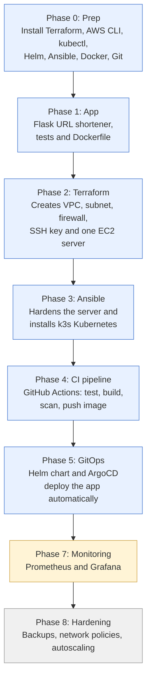
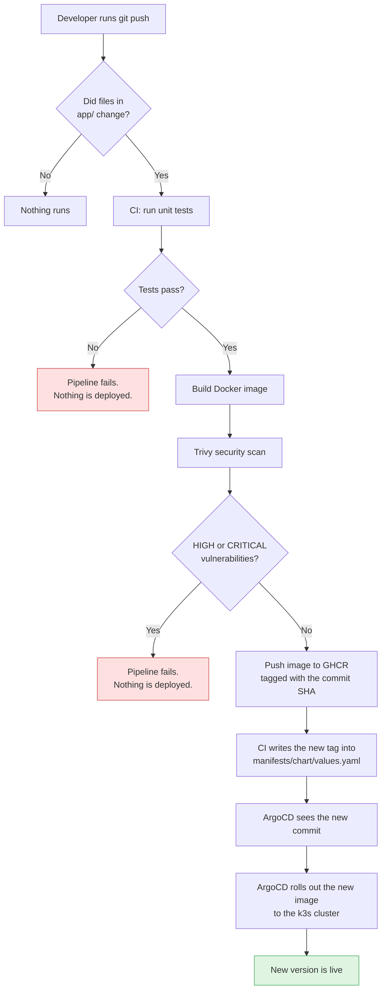
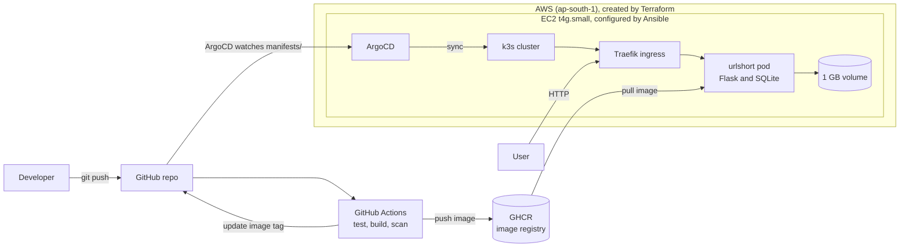

# urlshort: an end-to-end DevOps project

A URL shortener deployed with a fully automated pipeline: **`git push` goes to a live app**, on one low-cost AWS server. The app is small on purpose, because the point of the project is the platform around it.

---

## 1. How we built it (the journey)



Blue means done, yellow means next, grey means planned. Phase 6 (real domain and HTTPS) was skipped on purpose, and the app is served over HTTP using a free `nip.io` hostname.

---

## 2. What happens when you push code



CI only reacts to changes under `app/`. The bot commit that updates the image tag touches only `manifests/`, so it cannot start another pipeline run (no loop).

---

## 3. Architecture (where things run)



---

## What each part does

| Layer | Tool | Role |
|---|---|---|
| App | Python Flask and SQLite | Shortens URLs, redirects, counts hits, exposes `/healthz` |
| Container | Docker (multi-stage) | Small image, non-root user, health check |
| CI | GitHub Actions | Runs tests, builds a multi-arch image, scans it, pushes it |
| Security scan | Trivy | Fails the build on HIGH or CRITICAL vulnerabilities |
| Registry | GitHub Container Registry | Stores `amd64` and `arm64` images |
| Infrastructure | Terraform | VPC, subnet, security group, key pair, EC2 server |
| State | S3 (native locking) | Remote Terraform state |
| Configuration | Ansible | Server hardening (SSH keys only, UFW, fail2ban) and k3s install |
| Cluster | k3s | Lightweight single-node Kubernetes with Traefik ingress |
| Packaging | Helm | Deployment, Service, Ingress and volume for the app |
| CD / GitOps | ArgoCD | Watches `manifests/` and syncs the cluster to match Git |

## Repo layout

```
urlshort/
├── app/             Flask app, tests, Dockerfile
├── infra/
│   ├── terraform/   AWS resources
│   └── ansible/     server hardening and k3s install
├── manifests/
│   ├── chart/       Helm chart for the app
│   └── argocd/      ArgoCD Application definition
├── monitoring/      Prometheus and Grafana (next)
└── .github/workflows/ci.yml
```

## Project status

| Phase | Status |
|---|---|
| 1. App, tests, Dockerfile | Done |
| 2. Terraform (8 resources) | Done |
| 3. Ansible hardening and k3s | Done |
| 4. CI: test, build, scan, push | Done |
| 5. Helm chart and ArgoCD GitOps | Done, app is live |
| 5b. Automatic image tag update | Added, being verified |
| 6. Domain and HTTPS | Skipped (HTTP via nip.io) |
| 7. Monitoring (Prometheus, Grafana) | Next |
| 8. Backups, network policies, autoscaling | Planned |

## Run it yourself

**Prerequisites:** AWS account, Terraform, AWS CLI, kubectl, Helm, Ansible, Docker, GitHub CLI.

```bash
# 1. Remote state bucket (one time)
aws s3api create-bucket --bucket urlshort-tfstate-<ACCOUNT_ID> --region ap-south-1 \
  --create-bucket-configuration LocationConstraint=ap-south-1

# 2. SSH key and server
ssh-keygen -t ed25519 -f ~/.ssh/urlshort -N ""
cd infra/terraform
echo "admin_cidr = \"$(curl -s https://checkip.amazonaws.com)/32\"" > terraform.tfvars
terraform init -backend-config="bucket=urlshort-tfstate-<ACCOUNT_ID>"
terraform apply

# 3. Harden the server and install k3s
#    (create infra/ansible/inventory.ini with the server IP first)
cd ../ansible
ansible-playbook site.yml

# 4. Install ArgoCD and deploy the app
export KUBECONFIG=~/.kube/urlshort.yaml
helm repo add argo https://argoproj.github.io/argo-helm
helm install argocd argo/argo-cd -n argocd --create-namespace \
  --set dex.enabled=false --set notifications.enabled=false \
  --set-string configs.params."server\.insecure"=true
kubectl apply -f manifests/argocd/app.yaml
```

Then set the ingress host in `manifests/chart/values.yaml` to `urlshort.<SERVER_IP>.nip.io`.

## Using the app

```bash
URL=http://urlshort.<SERVER_IP>.nip.io
curl $URL/healthz
curl -X POST $URL/api/shorten -H "Content-Type: application/json" -d '{"url":"https://example.com"}'
curl $URL/api/stats/<code>
```

## Design decisions

- **Single-node k3s instead of EKS.** It costs roughly one small server, with no managed control plane, NAT gateway or load balancer. The tradeoff is no high availability.
- **Monorepo.** One repo is easier to browse for a solo project. Larger teams usually split app and manifests, and the CI path filters prevent pipeline loops here.
- **GitOps with ArgoCD.** Git is the source of truth, and ArgoCD heals manual drift.
- **Multi-arch images.** The server is ARM (Graviton) while CI and many dev machines are x86.
- **Security basics.** Non-root container, IMDSv2 only, encrypted disks, SSH and the Kubernetes API restricted to the admin IP, keys-only SSH, fail2ban, image scanning in CI.
- **Pinned and verified actions.** The Trivy action was moved to a safe release after its older tags were compromised in March 2026.
- **`Recreate` rollout strategy.** SQLite sits on a single ReadWriteOnce volume, so two pods must never run at once.

## Costs and cleanup

Roughly the price of one `t4g.small` plus one public IPv4 address. To remove everything:

```bash
cd infra/terraform && terraform destroy
```
